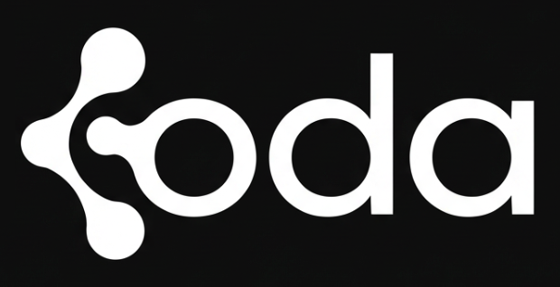
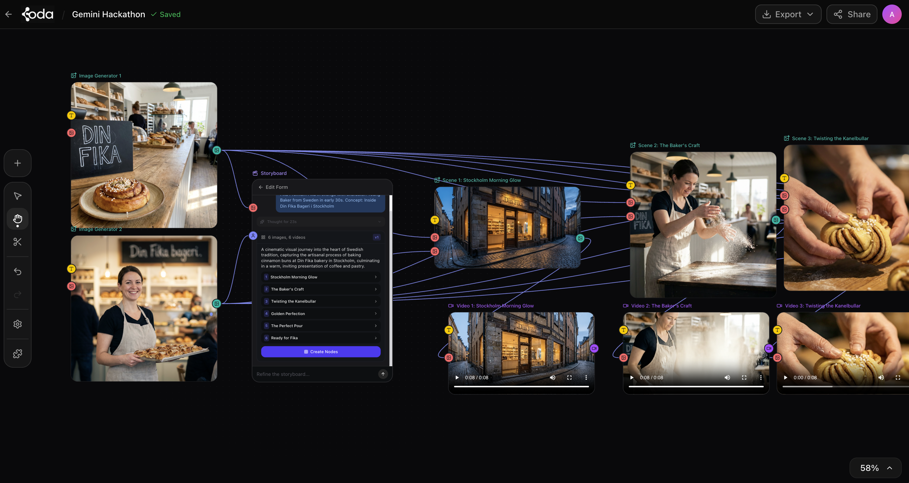
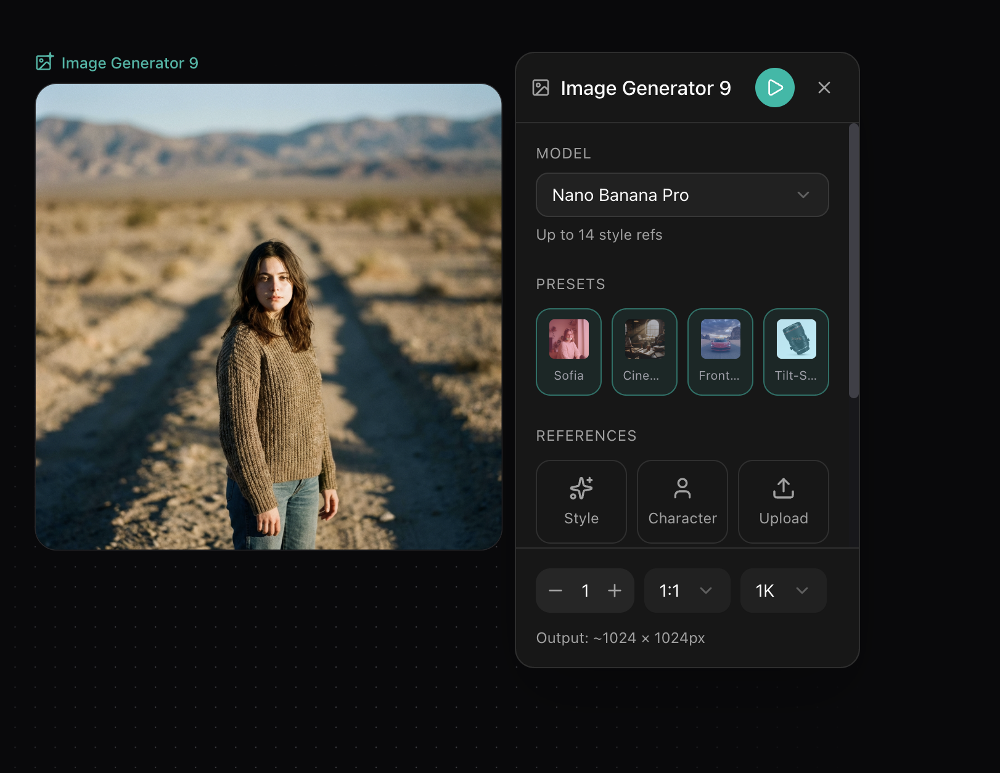
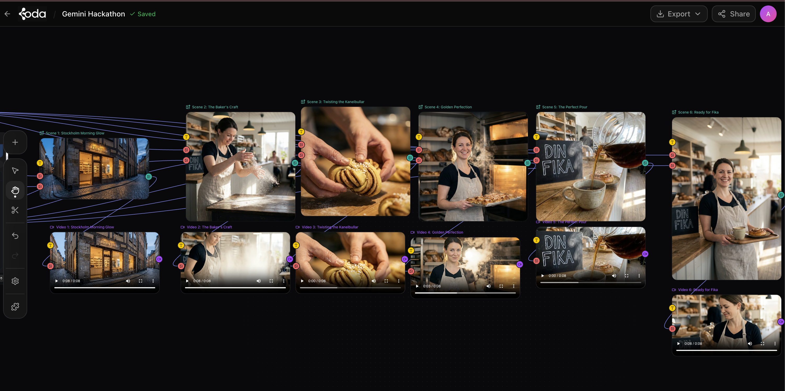
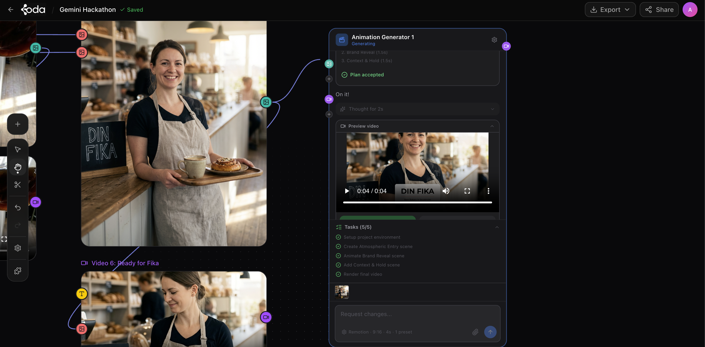
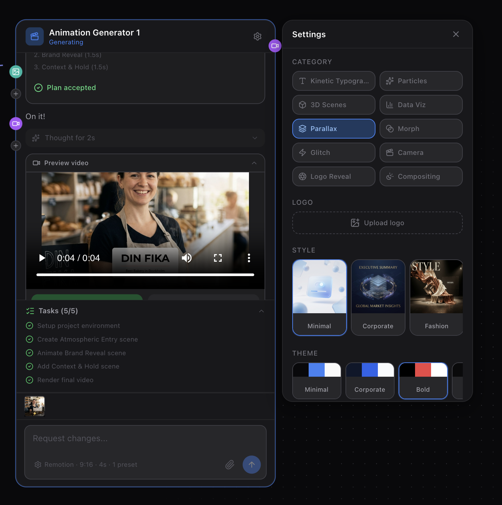

<div align="center">



**A node-based visual workflow editor for AI-powered image, video, and animation generation.**

Drag nodes onto an infinite canvas. Connect them. Generate AI content. Think of it as a visual programming environment for creative AI workflows.

[](https://youtu.be/mPuy6vFPdoU)
[](https://nextjs.org)
[](https://ai.google.dev)
[](https://mastra.ai)
[](#license)

</div>

<br>

<div align="center">

https://youtu.be/mPuy6vFPdoU

</div>

<br>

<p align="center">
  
</p>

## What is Koda?

Koda is a canvas-based creative studio where AI nodes connect into workflows. Instead of chatting with AI in a single text box, you wire together specialized nodes — image generators, video generators, text prompts, media uploads, and AI agent plugins — into visual pipelines that produce creative content.

**Core capabilities:**

- **Image Generation** — 6 models including **Nano Banana Pro**, Flux, Recraft, Ideogram, and SD 3.5 with presets for character, style, camera angle, and lens
- **Video Generation** — 10 models led by **Google Veo 3**, plus Kling 2.6, Luma Ray2, Minimax, and Runway Gen3 with duration/resolution controls
- **AI Animation** — Generate programmatic 2D/3D animations from text prompts using Remotion and Theatre.js, rendered in isolated sandboxes
- **Plugin System** — Extensible architecture for custom AI tools (storyboard generator, product shots, prompt enhancer, and more)
- **Visual Workflows** — Connect nodes with edges, batch-run pipelines, undo/redo, copy/paste, export

---

## Table of Contents

- [Features](#features)
- [Architecture](#architecture)
- [Quick Start](#quick-start)
- [Environment Variables](#environment-variables)
- [Animation Plugin](#animation-plugin)
- [Plugin System](#plugin-system)
- [Node Types](#node-types)
- [Deployment](#deployment)
- [Project Structure](#project-structure)
- [Tech Stack](#tech-stack)
- [Documentation](#documentation)
- [Contributing](#contributing)
- [License](#license)

---

## Features

### Canvas Editor
- Infinite pan/zoom canvas powered by React Flow
- Drag-and-drop node creation from toolbar
- Visual connections between nodes (edges)
- Multi-select, group, copy/paste, duplicate
- 50-level undo/redo history
- Right-click context menus
- Keyboard shortcuts (Ctrl+Z, Ctrl+C, Ctrl+V, etc.)
- Export workflows as JSON or PNG

### AI Generation

<p align="center">
  
</p>

- **6 image models** with configurable aspect ratio, resolution, CFG scale, steps, and strength
- **10 video models** with text-to-video and image-to-video modes
- **Preset system** — Character, Style, Camera Angle, Camera Lens presets with thumbnail previews
- **Prompt enhancement** — AI-powered prompt rewriting for better outputs
- **Batch generation** — Run All button to execute every generator node at once
- **Reference images** — Connect media/image nodes as inputs for style/composition control

<p align="center">
  
</p>

### Animation Generation
- Text-to-animation pipeline with plan approval workflow
- **Remotion** (2D timeline animations) and **Theatre.js** (3D cinematic scenes)
- 10 technique presets: kinetic typography, particle systems, 3D scenes, data visualization, parallax, morph transitions, glitch effects, camera movements, logo reveals, compositing
- Isolated sandbox execution (Docker local or E2B cloud)
- Real-time streaming progress with thinking indicators
- Code snapshot/restore for iterative editing
- Media upload support (embed images/videos in animations)

### Plugin Architecture
- **Simple plugins** — Prompt-in, text-out (no code needed)
- **Transform plugins** — Image/video processing via APIs
- **Agent plugins** — Multi-step AI workflows with tool orchestration
- Canvas API for plugins to read/write/create nodes programmatically

---

## Architecture

```
┌─────────────────────────────────────────────────────┐
│                    Browser                          │
│  ┌───────────┐  ┌──────────┐  ┌──────────────────┐ │
│  │  React    │  │  Zustand  │  │  localStorage    │ │
│  │  Flow     │←→│  Store    │←→│  (persistence)   │ │
│  │  Canvas   │  │           │  │                  │ │
│  └───────────┘  └──────────┘  └──────────────────┘ │
└───────────────────────┬─────────────────────────────┘
                        │ API Routes
┌───────────────────────┴─────────────────────────────┐
│                  Next.js Server                     │
│                                                     │
│  /api/generate          → Fal.ai (images)           │
│  /api/generate-video    → Fal.ai (videos)           │
│  /api/agents/*          → Mastra AI agents          │
│  /api/plugins/animation → Animation streaming       │
│                                                     │
│  ┌─────────────────────────────────────────────┐    │
│  │              Mastra Agents                   │    │
│  │  ┌──────────┐  ┌──────────┐  ┌───────────┐ │    │
│  │  │Orchestr- │  │Code Gen  │  │Prompt     │ │    │
│  │  │ator      │  │Subagents │  │Enhancer   │ │    │
│  │  │(Gemini)  │  │(Gemini)  │  │(Gemini)   │ │    │
│  │  └──────────┘  └──────────┘  └───────────┘ │    │
│  │  15 tools: sandbox, render, verify, plan... │    │
│  └─────────────────────────────────────────────┘    │
│                                                     │
│  ┌──────────────┐  ┌──────────┐  ┌──────────────┐  │
│  │   SQLite /   │  │ Local /  │  │  Docker /    │  │
│  │   Turso DB   │  │ R2 / S3  │  │  E2B Cloud   │  │
│  │  (projects)  │  │ (assets) │  │  (sandboxes) │  │
│  └──────────────┘  └──────────┘  └──────────────┘  │
└─────────────────────────────────────────────────────┘
```

**Local-first by default.** No external database needed to get started — state lives in Zustand with localStorage persistence. Optionally add Turso (cloud DB), Cloudflare R2 (asset storage), and E2B (cloud sandboxes) for production deployments.

---

## Quick Start

### Prerequisites

- **Node.js** 20+
- **Docker** (for animation sandbox — optional but recommended)
- API keys for at least one AI provider

### 1. Clone and install

```bash
git clone https://github.com/realaman90/koda.git
cd koda
npm install
```

### 2. Configure environment

```bash
cp .env.example .env
```

Open `.env` and add your API keys:

```env
# Required — pick at least one
ANTHROPIC_API_KEY=sk-ant-...       # For Mastra agents (fallback)
FAL_KEY=...                        # For image/video generation

# Recommended — primary AI model
GOOGLE_GENERATIVE_AI_API_KEY=...   # For Gemini (animation agents)
# OR
OPENROUTER_API_KEY=...             # Alternative: access Gemini via OpenRouter
```

### 3. Build the animation sandbox (optional)

If you want the animation generation feature:

```bash
cd templates/remotion-sandbox
docker build -t koda-remotion-sandbox .
cd ../..
```

### 4. Set up the database (optional)

For project persistence beyond localStorage:

```bash
npm run db:generate
npm run db:migrate
```

### 5. Start the dev server

```bash
npm run dev
```

Open [http://localhost:3000](http://localhost:3000) — you're in.

---

## Environment Variables

Koda supports **mix-and-match deployment** — use local storage with cloud sandboxes, or cloud DB with local assets. Copy `.env.example` and configure what you need:

| Variable | Required | Default | Description |
|----------|----------|---------|-------------|
| `NEXT_PUBLIC_CLERK_PUBLISHABLE_KEY` | Yes | — | Clerk publishable key (client auth) |
| `CLERK_SECRET_KEY` | Yes | — | Clerk secret key (server auth + middleware) |
| `CLERK_WEBHOOK_SIGNING_SECRET` | Yes | — | Verify `/api/webhooks/clerk` signatures |
| `ANTHROPIC_API_KEY` | Yes* | — | Anthropic API key (agent fallback) |
| `FAL_KEY` | Yes* | — | Fal.ai key (image/video generation) |
| `GOOGLE_GENERATIVE_AI_API_KEY` | Recommended | — | Google AI key (Gemini models) |
| `OPENROUTER_API_KEY` | Alt | — | OpenRouter key (multi-model access) |
| `NEXT_PUBLIC_STORAGE_BACKEND` | No | `sqlite` | `sqlite` or `turso` |
| `ASSET_STORAGE` | No | `local` | `local`, `r2`, or `s3` |
| `SANDBOX_PROVIDER` | No | `docker` | `docker` or `e2b` |
| `SNAPSHOT_STORAGE` | No | `local` | `local` or `r2` |

*At minimum you need one AI provider key and `FAL_KEY` for image/video gen.

See [`.env.example`](.env.example) for the full list with comments.

---

## Animation Plugin

The animation system is Koda's most advanced feature — a multi-phase AI pipeline that turns text prompts into rendered video animations.

<p align="center">
  
</p>

### How it works

```
"Create a particle explosion that forms into a logo"
    │
    ▼
┌─────────────────────────────────────────┐
│  Phase 1: Enhance Prompt                │
│  Gemini Pro rewrites → detailed spec    │
├─────────────────────────────────────────┤
│  Phase 2: Generate Plan                 │
│  Scene breakdown → user approval gate   │
├─────────────────────────────────────────┤
│  Phase 3: Execute                       │
│  Create sandbox → generate code →       │
│  write files → render video             │
├─────────────────────────────────────────┤
│  Phase 4: Deliver                       │
│  Video URL + snapshot for editing       │
└─────────────────────────────────────────┘
```

<p align="center">
  
</p>

### Key capabilities

- **Dual render engines** — Remotion for 2D motion graphics, Theatre.js for 3D cinematic scenes
- **Plan approval** — Review the AI's scene plan before it generates code (enforced at the code level, not just instructions)
- **Iterative editing** — Send follow-up messages to modify existing animations without regenerating from scratch
- **Code snapshots** — Animation code is saved so sandboxes can be restored if they die
- **10 technique presets** — Kinetic typography, particles, 3D scenes, data-viz, parallax, morphing, glitch, camera movements, logo reveals, compositing
- **Media embedding** — Upload images/videos to include in your animations

### Sandbox options

| Provider | Setup | Resources | Best for |
|----------|-------|-----------|----------|
| **Docker** (local) | `docker build` | Configurable (default 2 CPU, 1GB) | Development, self-hosting |
| **E2B** (cloud) | API key | 8 vCPU, 8GB RAM per sandbox | Production, zero Docker setup |

### AI models used

All animation models default to **Google Gemini 3** (configurable in `src/mastra/models.ts`):

| Role | Model | Why |
|------|-------|-----|
| Orchestrator | Gemini 3 Flash | Fast tool orchestration |
| Code generation | Gemini 3 Flash | Quick iteration on Remotion/Theatre code |
| Prompt enhancement | Gemini 3 Pro | Better reasoning for design specs |
| Video analysis | Gemini 3 Flash | Native video understanding |

> Models are swappable — uncomment alternatives in `src/mastra/models.ts` to use Claude, Kimi, or others.

---

## Plugin System

Koda has a three-tier plugin architecture designed for extensibility:

### Simple Plugins (no-code)
Prompt template → AI response → output. Anyone can create these.

- **Reverse Prompt** — Describe what's in an image
- **Caption Generator** — Social media captions from images
- **Script to Scenes** — Break scripts into visual scene descriptions

### Transform Plugins (API-based)
Image/video processing through external APIs.

- **Background Remover** — Remove backgrounds from images
- **Upscaler** — Increase image resolution
- **Aspect Ratio Converter** — Resize/crop for different formats

### Agent Plugins (multi-step)
Full AI agents with tool access and streaming UI.

- **Animation Generator** — Text-to-video animation pipeline
- **Storyboard Generator** — Break scripts into visual scene cards
- **Product Shot Generator** — E-commerce product renders

See [`docs/PLUGIN_ARCHITECTURE.md`](docs/PLUGIN_ARCHITECTURE.md) for the full plugin development guide.

---

## Node Types

| Node | Purpose | Inputs | Outputs |
|------|---------|--------|---------|
| **Image Generator** | AI image synthesis | Text prompt, reference images | 1-4 images |
| **Video Generator** | AI video synthesis | Text prompt, reference images | Video file |
| **Text** | Text input/output | User text | Text handle |
| **Media** | Image upload | Drag-drop, URL, paste | Image handle |
| **Animation** | AI animation generation | Text prompt, media files | Rendered video |
| **Storyboard** | Script → scene cards | Text input | Scene breakdown |
| **Product Shot** | E-commerce renders | Product image, prompt | Styled product images |
| **Sticky Note** | Canvas annotations | User text | — |
| **Group** | Organize nodes | Drag to group | — |
| **Rich Text** | Formatted text editing | User input | — |
| **Music Generator** | AI music | Text prompt | Audio file |

---

## Deployment

### Local development
```bash
npm run dev    # http://localhost:3000
```

### Production (self-hosted)
```bash
npm run build
npm run start
```

### Cloud deployment

Koda supports flexible backend configurations:

| Component | Local (default) | Cloud option |
|-----------|----------------|--------------|
| **Database** | SQLite file | [Turso](https://turso.tech) (libSQL cloud) |
| **Assets** | `./data/generations/` | [Cloudflare R2](https://developers.cloudflare.com/r2/) or AWS S3 |
| **Sandboxes** | Docker containers | [E2B](https://e2b.dev) (managed cloud sandboxes) |
| **Snapshots** | `./data/snapshots/` | Cloudflare R2 |

See [`docs/DEPLOYMENT.md`](docs/DEPLOYMENT.md) and [`docs/SELF_HOSTING.md`](docs/SELF_HOSTING.md) for detailed setup guides.

---

## Project Structure

```
src/
├── app/                          # Next.js App Router
│   ├── page.tsx                  # Main canvas page
│   └── api/
│       ├── generate/             # Image generation proxy
│       ├── generate-video/       # Video generation proxy
│       ├── agents/               # Prompt enhancement
│       └── plugins/              # Animation, storyboard, product-shot
├── components/
│   ├── canvas/
│   │   ├── Canvas.tsx            # React Flow wrapper
│   │   ├── NodeToolbar.tsx       # Left sidebar tools
│   │   ├── SettingsPanel.tsx     # Floating node settings
│   │   └── nodes/                # 16 node type components
│   └── ui/                       # shadcn/ui components
├── stores/
│   └── canvas-store.ts           # Zustand state (main store)
├── lib/
│   ├── types.ts                  # TypeScript types
│   ├── model-adapters.ts         # Model → API adapters
│   ├── plugins/                  # Plugin system (registry, types, canvas API)
│   ├── sandbox/                  # Docker + E2B sandbox providers
│   ├── db/                       # Drizzle ORM schema + queries
│   └── assets/                   # S3/R2 signing utilities
├── mastra/
│   ├── models.ts                 # AI model constants (swap models here)
│   ├── agents/                   # Mastra agent definitions
│   │   ├── animation-agent.ts    # Orchestrator agent
│   │   └── instructions/         # System prompts (XML format)
│   ├── tools/                    # 15+ agent tools
│   │   └── animation/            # Sandbox, render, code gen, verify
│   └── recipes/                  # 10 technique preset templates
└── env.ts                        # Environment config
templates/
├── remotion-sandbox/             # Docker image for Remotion rendering
└── sandbox/                      # Docker image for Theatre.js
docs/                             # 12 detailed documentation files
```

---

## Tech Stack

| Layer | Technology |
|-------|-----------|
| **Framework** | [Next.js 16](https://nextjs.org) (App Router) |
| **Canvas** | [@xyflow/react](https://reactflow.dev) (React Flow 12) |
| **State** | [Zustand 5](https://zustand.docs.pmnd.rs) + localStorage persistence |
| **UI** | [Tailwind CSS 4](https://tailwindcss.com) + [shadcn/ui](https://ui.shadcn.com) |
| **AI Agents** | [Mastra 1.2](https://mastra.ai) + [Vercel AI SDK 6](https://sdk.vercel.ai) |
| **AI Models** | [Google Gemini 3](https://ai.google.dev) (primary), Claude (fallback) |
| **Image/Video** | [Fal.ai](https://fal.ai) (Flux, Veo, Kling, Luma, Runway, etc.) |
| **Animation** | [Remotion](https://remotion.dev) (2D) + [Theatre.js](https://theatrejs.com) (3D) |
| **Sandboxes** | Docker (local) or [E2B](https://e2b.dev) (cloud) |
| **Database** | SQLite / [Turso](https://turso.tech) via [Drizzle ORM](https://orm.drizzle.team) |
| **Storage** | Local filesystem / [Cloudflare R2](https://developers.cloudflare.com/r2/) / AWS S3 |
| **Validation** | [Zod 4](https://zod.dev) |

---

## Documentation

Detailed documentation lives in the [`docs/`](docs/) directory:

| Document | Description |
|----------|-------------|
| [`DEPLOYMENT.md`](docs/DEPLOYMENT.md) | Cloud and self-hosted deployment guide |
| [`SELF_HOSTING.md`](docs/SELF_HOSTING.md) | Local hosting setup and configuration |
| [`SANDBOX_CONFIGURATION.md`](docs/SANDBOX_CONFIGURATION.md) | Docker sandbox resource tuning |

---

## Keyboard Shortcuts

| Action | Shortcut |
|--------|----------|
| Undo | `Ctrl+Z` |
| Redo | `Ctrl+Shift+Z` |
| Copy | `Ctrl+C` |
| Paste | `Ctrl+V` |
| Cut | `Ctrl+X` |
| Duplicate | `Ctrl+D` |
| Delete | `Delete` / `Backspace` |
| Select All | `Ctrl+A` |
| Pan Mode | `Space` (hold) |
| Fit View | `F` |

---

## Scripts

```bash
npm run dev          # Start development server
npm run build        # Production build
npm run start        # Start production server
npm run lint         # Run ESLint
npm run db:generate  # Generate Drizzle migrations
npm run db:migrate   # Run database migrations
npm run db:studio    # Open Drizzle Studio (DB browser)
```

---

## Contributing

Contributions are welcome. Here's how to get started:

1. Fork the repository
2. Create a feature branch (`git checkout -b feat/my-feature`)
3. Make your changes
4. Run `npm run lint` and `npm run build` to verify
5. Commit and push
6. Open a pull request

### Adding a new node type

1. Create the component in `src/components/canvas/nodes/`
2. Export it from `src/components/canvas/nodes/index.ts`
3. Add the creator function in `stores/canvas-store.ts`
4. Add it to `NodeToolbar.tsx` and `ContextMenu.tsx`
5. Define types in `lib/types.ts`

### Adding a new AI model

1. Create an adapter class in `lib/model-adapters.ts`
2. Add to the model registry
3. Update the type union in `lib/types.ts`
4. Add to the model selector in `SettingsPanel.tsx`

---

## License

MIT

---

<div align="center">

Built with [Next.js](https://nextjs.org), [React Flow](https://reactflow.dev), [Mastra](https://mastra.ai), [Google Gemini](https://ai.google.dev), and [Fal.ai](https://fal.ai)

</div>
